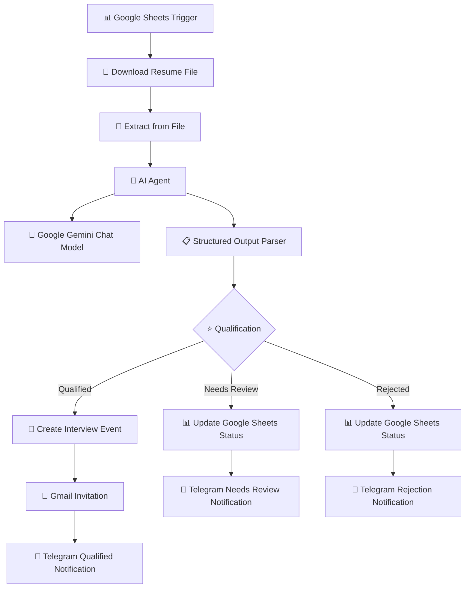

# 📄 AI Resume Screening & Interview Scheduling System — n8n Automation


An AI-powered recruitment automation workflow built using **n8n**, **Google Gemini AI**, **Google Workspace**, and **Telegram Bot API**.

This system automatically receives candidate applications, processes uploaded resumes, analyzes candidate qualifications using AI, categorizes applicants, updates recruitment records, schedules interviews for qualified candidates, and sends automated notifications.

The workflow acts as an AI recruitment assistant that reduces manual resume screening and improves hiring efficiency.

---

# 🚀 Project Overview

## Problem

Recruitment teams often spend significant time manually reviewing resumes and organizing candidate information.

Common challenges:

- Manually reading large numbers of resumes
- Slow candidate evaluation
- Inconsistent screening decisions
- Repetitive candidate communication
- Manual interview scheduling
- Difficult applicant tracking


---

# 💡 Solution

This project creates an automated AI recruitment pipeline that:

1. Collects candidate applications through Google Forms
2. Detects new applications using Google Sheets Trigger
3. Downloads uploaded resume files
4. Extracts resume content from PDF files
5. Uses Google Gemini AI to evaluate candidates
6. Generates structured candidate assessments
7. Classifies applicants based on qualification score
8. Updates recruitment records automatically
9. Schedules interviews for qualified candidates
10. Sends email and Telegram notifications


---

# ✨ Features

## 📄 Resume Processing

✅ Automatic resume file retrieval  
✅ PDF text extraction  
✅ Candidate information processing  
✅ Resume preparation for AI analysis  


---

## 🤖 Artificial Intelligence

✅ Google Gemini AI resume evaluation  
✅ AI Agent workflow processing  
✅ Candidate qualification analysis  
✅ Structured AI output generation  
✅ Automated hiring recommendations  


---

## 🎯 Candidate Qualification

Applicants are automatically categorized:

| Score | Status |
|---|---|
| 80-100 | Qualified |
| 50-79 | Needs Review |
| Below 50 | Rejected |


---

## 📅 Interview Automation

For qualified candidates:

✅ Google Calendar interview creation  
✅ Automatic Gmail invitation  
✅ Recruiter Telegram notification  


---

## 📊 Recruitment Tracking

✅ Google Sheets candidate database  
✅ Applicant status updates  
✅ Candidate history tracking  


---

## 📱 Notifications

✅ Telegram recruiter alerts  
✅ Automated candidate communication  


---

# 🏗️ System Architecture




---

# ⚙️ Workflow Implementation

## Node 1 — Google Sheets Trigger

### Purpose

Detects new candidate applications submitted through the recruitment form.

Input Data:

| Field | Description |
|-|-|
| Name | Candidate name |
| Email | Candidate contact |
| Position | Job applied |
| Resume | Uploaded resume file |


---

# Node 2 — Download File

### Purpose

Downloads the candidate resume file for processing.

Process:

```
Resume Link

↓

Download PDF File

↓

Send File For Extraction
```


---

# Node 3 — Extract From File

### Purpose

Extracts readable text from uploaded PDF resumes.

Extracted Information:

- Education
- Technical skills
- Work experience
- Certifications
- Achievements


Example:

```
Resume PDF

↓

Text Extraction

↓

AI Analysis
```


---

# Node 4 — AI Agent

### Purpose

Controls the AI resume evaluation process.

The AI Agent sends extracted resume information to Google Gemini and processes the generated response.


Responsibilities:

- Resume understanding
- Candidate evaluation
- Qualification analysis
- Recommendation generation


---

# Node 5 — Google Gemini Chat Model

### Purpose

Analyzes the candidate resume using artificial intelligence.

Evaluation Criteria:

- Technical skills
- Education background
- Experience
- Job compatibility
- Certifications


Example AI Output:

```json
{
"name":"John Smith",
"score":88,
"status":"Qualified",
"recommendation":"Interview",
"summary":"Strong technical background with relevant experience."
}
```


---

# Node 6 — Structured Output Parser

### Purpose

Converts AI-generated responses into structured data.

Before:

```
Gemini Response

(Unstructured Text)
```

After:

```
Structured JSON Data
```

Extracted Fields:

- Score
- Status
- Recommendation
- Summary


---

# Node 7 — Qualification IF Node

### Purpose

Automatically decides candidate workflow based on AI evaluation.


Logic:

```javascript
if(score >= 80)

Qualified


else if(score >= 50)

Needs Review


else

Rejected
```


---

# Node 8 — Qualified Candidate Flow

Qualified candidates automatically receive:

## Google Calendar

Creates an interview event.

Information:

- Candidate email
- Interview schedule
- Meeting details


## Gmail

Sends interview invitation.

Includes:

- Interview date
- Meeting details
- Confirmation message


## Telegram

Notifies recruiter.

Example:

```
✅ Qualified Candidate

Name:
John Smith

Score:
88/100

Status:
Interview Scheduled
```


---

# Node 9 — Needs Review Flow

Candidates requiring manual evaluation are updated.

Actions:

✅ Update Google Sheets status  
✅ Send Telegram notification  


Example:

```
🔎 Candidate Needs Review

Name:
John Smith

Score:
65/100

Action:
Manual Review Required
```


---

# Node 10 — Rejected Candidate Flow

Automatically updates rejected applications.

Actions:

✅ Update Google Sheets status  
✅ Send Telegram notification  


---

# 🔐 Required Credentials


| Service | Purpose |
|-|-|
| Google Sheets OAuth2 | Candidate database |
| Google Drive OAuth2 | Resume file access |
| Google Gemini API | AI evaluation |
| Google Calendar OAuth2 | Interview scheduling |
| Gmail OAuth2 | Email invitations |
| Telegram Bot API | Notifications |
| n8n Instance | Workflow execution |


---

# 🛠️ Setup Guide


## 1. Create Application Form

Create Google Form fields:

```
Full Name

Email Address

Position Applied

Resume Upload

Cover Letter
```


Connect responses to Google Sheets.


---

## 2. Configure Resume Processing

Setup:

```
Google Drive Access

↓

Resume Download

↓

PDF Extraction
```


---

## 3. Configure Google Gemini

Required:

```
Gemini API Key

AI Model Access
```


Test AI resume evaluation.


---

## 4. Configure Google Calendar

Enable:

```
Calendar API

Google Meet Creation

Event Scheduling
```


---

## 5. Configure Gmail

Setup:

```
Gmail OAuth2

Email Templates
```


---

## 6. Configure Telegram Bot

Steps:

1. Create bot using BotFather
2. Copy bot token
3. Add Telegram credentials
4. Configure recruiter chat ID


---

# 🧪 Testing Checklist


| Test | Expected Result |
|-|-|
| Submit application | Candidate recorded |
| Resume uploaded | File downloaded |
| PDF extraction | Resume text generated |
| Gemini analysis | Candidate evaluated |
| Output parser | JSON created |
| Qualification node | Correct route selected |
| Qualified flow | Interview created |
| Gmail | Invitation sent |
| Telegram | Notification received |
| Sheets | Status updated |


---

# 📁 Repository Structure


```
AI-Resume-Screening-and-Interview-Scheduling-System/

│
├── README.md
│
├── workflow.json
│
├── screenshots/
│
│   ├── workflow.png
│   ├── google-sheets.png
│   ├── resume-processing.png
│   ├── ai-analysis.png
│   ├── qualification.png
│   ├── google-calendar.png
│   ├── gmail-invitation.png
│   └── telegram-notification.png
│
├── sample-data/
│
│   ├── sample-resume.pdf
│   └── sample-ai-output.json
│
└── LICENSE
```


---

# 📸 Screenshots

Recommended screenshots:

- Complete n8n workflow
- Google Sheets application data
- Resume extraction process
- AI Agent evaluation
- Gemini output
- Qualification decision
- Google Calendar interview
- Gmail invitation
- Telegram notification
- Workflow execution logs


---

# 🚀 Future Improvements


| Feature | Implementation |
|-|-|
| AI Interview Questions | Generate questions from resumes |
| Candidate Dashboard | Recruitment analytics interface |
| PostgreSQL Storage | Advanced candidate database |
| ATS Integration | Connect recruitment platforms |
| Resume Ranking | Advanced candidate comparison |
| Human Approval Workflow | Recruiter decision system |
| Job Description Matching | Compare resumes against roles |


---

# 🎓 Skills Demonstrated


## Automation

- n8n workflow automation
- Business process automation
- Event-driven workflows


## Artificial Intelligence

- Google Gemini AI
- AI Agent implementation
- Prompt engineering
- Resume analysis


## APIs

- Google Workspace APIs
- Gmail API
- Calendar API
- Telegram Bot API


## Programming

- JavaScript
- JSON processing
- Data transformation
- Conditional logic


---

# 📚 Learning Objectives


This project demonstrates:

- Building AI-powered recruitment automation systems
- Integrating AI with business workflows
- Processing documents automatically
- Creating AI decision pipelines
- Automating HR processes using n8n


---

# 👨‍💻 Author


**Belio C. Sinangote**

BS Information Technology Student  
Cebu Technological University


GitHub:

https://github.com/belioautomation


This project is part of my **30-Day n8n Automation Portfolio**, showcasing practical automation systems using:

**n8n · AI Integrations · APIs · Google Workspace · Business Automation**


---

# 📄 License

MIT License
